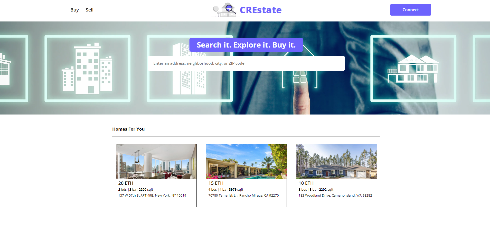

# Web 3.0 Real Estate App

This is a decentralized **Web 3.0 Real Estate Application**

<div style="text-align:center;margin:30px auto;">
  
</div>

The goal is to enable a peer-to-peer real estate marketplace where users can list (for future implementation), buy, and sell properties in a decentralized manner.

## Table of Contents

- [Features](#features)
- [Technologies Used](#technologies-used)
- [Project Structure](#project-structure)
- [Requirements](#requirements)
- [Installation and Setup](#installation-and-setup)
- [How to Use](#how-to-use)

## Features

- **List Properties**: Users can list real estate properties on the platform (for future implementation).
- **Search Properties**: Users can search real estate properties on the platform (for future implementation).
- **Purchase Properties**: Users can buy listed properties using cryptocurrency.
- **Decentralized Ownership**: Property ownership is managed using smart contracts and recorded on the blockchain.
- **Secure Transactions**: All transactions are secure and transparent using Ethereum smart contracts.

## Technologies Used

- **Solidity**: For writing smart contracts.
- **Hardhat**: Development framework for deploying and testing smart contracts.
- **Ethers.js**: For interacting with the Ethereum blockchain from the React.js frontend.
- **React.js**: Frontend framework for building the user interface.
- **MetaMask**: To interact with the Ethereum network from the browser.

## Project Structure

```bash
web3-real-estate-app/
├── contracts/           # Solidity Smart Contracts
│   └── RealEstate.sol   # Smart contract for Real Estate NFT
│   └── Escrow.sol   # Smart contract for managing properties
├── scripts/             # Hardhat scripts for deploying contracts
│   └── deploy.js
├── test/                # Smart contract tests using Hardhat and Mocha
│   └── Escrow.js
├── src/            # React.js frontend
│   ├── components/  # React components
│   ├── App.js       # Main React app file
│   └── index.js     # Entry point for React
├── hardhat.config.js    # Hardhat configuration
├── package.json         # Project dependencies and scripts
└── README.md            # Project documentation
```

## Requirements

- Install [NodeJS](https://nodejs.org/en/)

## Installation and Setup

### 1. Clone/Download the Repository

### 2. Install Dependencies:

`$ npm install`

### 3. Run tests

`$ npx hardhat test`

### 4. Start Hardhat node

`$ npx hardhat node`

### 5. Run deployment script

In a separate terminal execute:
`$ npx hardhat run ./scripts/deploy.js --network localhost`

### 6. Start frontend

`$ npm run start`
Open http://localhost:3000 in your browser to view the application.

## How to Use

- **Connect Wallet**: Connect your MetaMask wallet to the application.
- **List Property**: (for future implementation).
- **Buy Property**: Browse through available properties and make a purchase using your wallet balance.
